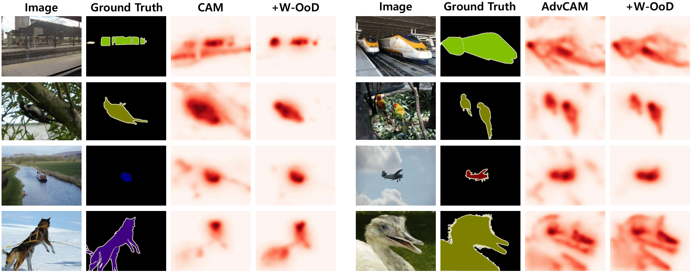

# [Weakly Supervised Semantic Segmentation using Out-of-Distribution Data (CVPR'22)](https://openaccess.thecvf.com/content/CVPR2022/papers/Lee_Weakly_Supervised_Semantic_Segmentation_Using_Out-of-Distribution_Data_CVPR_2022_paper.pdf)

by **Jungbeom Lee<sup>1</sup>, Seong Joon Oh<sup>2,3</sup>, Sangdoo Yun<sup>2</sup>, Junsuk Choe<sup>4</sup>, Eunji Kim<sup>1</sup>, Sungroh Yoon<sup>1</sup>** 

<sup>1</sup> Seoul National University, <sup>2</sup> NAVER AI Lab, <sup>3</sup> University of Tübingen, <sup>4</sup> Sogang University

<p align="center"></p>


## Abstract
Weakly supervised semantic segmentation (WSSS) methods are often built on pixel-level localization maps obtained from a classifier. However, training on class labels only, classifiers suffer from the spurious correlation between foreground and background cues (e.g. train and rail), fundamentally bounding the performance of WSSS. There have been previous endeavors to address this issue with additional supervision. We propose a novel source of information to distinguish foreground from the background: Out-of-Distribution (OoD) data, or images devoid of foreground object classes. 
In particular, we utilize the hard OoDs that the classifier is likely to make false-positive predictions.
These samples typically carry key visual features on the background (e.g. rail) that the classifiers often confuse as foreground (e.g. train), so these cues let classifiers correctly suppress spurious background cues. Acquiring such hard OoDs does not require an extensive amount of annotation efforts; it only incurs a few additional image-level labeling costs on top of the original efforts to collect class labels.We propose a method, W-OoD, for utilizing the hard OoDs. 
W-OoD achieves state-of-the-art performance on Pascal VOC 2012.


## Installation

- We refer to the offical implementation of [IRN](https://github.com/jiwoon-ahn/irn).


## Usage

#### Step 1. Prepare Dataset

- Download PASCAL VOC 2012 benchmark: [Download](https://drive.google.com/file/d/1-2cYvmJ4u52FvZ722eIti1jf5hfGr6Rz/view?usp=sharing).
- Unzip and move it to "Data/"
- Download OoD images: [Download](https://drive.google.com/file/d/1Zrwqiy-dt9aymtEzCt9qqWROMDj3EUUX)
- Unzip and move it to "WOoD_dataset/openimages"

#### Step 2. Prepare pre-trained in-distribution classifier

- Pre-trained model used in this paper: [Download](https://drive.google.com/file/d/1Eaa7BV6PAfRPEZYBz5WtllUJxpnO-a-m/view?usp=sharing).
- Move it to "sess/"


#### Step 3. Obtain the pseudo ground-truth masks for PASCAL VOC train_aug images and evaluate them
```
bash bash_run_sample.sh
```

#### Step 4. Train a semantic segmentation network
- To train DeepLab-v2, we refer to [deeplab-pytorch](https://github.com/kazuto1011/deeplab-pytorch). However, this repo contains only COCO pre-trained model. We use ImageNet pre-trained model, provided by [AdvCAM](https://github.com/jbeomlee93/AdvCAM), for a fair comparison with the other methods.


## Citation
If you find the code useful, please consider citing our paper using the following BibTeX entry.
```
@inproceedings{lee2022weakly,
  title={Weakly Supervised Semantic Segmentation using Out-of-Distribution Data},
  author={Lee, Jungbeom and Oh, Seong Joon and Yun, Sangdoo and Choe, Junsuk and Kim, Eunji and Yoon, Sungroh},
  booktitle={Proceedings of the IEEE/CVF Conference on Computer Vision and Pattern Recognition},
  pages={16897--16906},
  year={2022}
}
```

## Acknowledgment
- This work is a result of a joint project of NAVER and SNU.
- This code is heavily borrowed from [IRN](https://github.com/jiwoon-ahn/irn), and [AdvCAM](https://github.com/jbeomlee93/AdvCAM).

## License

```
MIT license

Copyright (c) 2022-present NAVER Corp.

Permission is hereby granted, free of charge, to any person obtaining a copy
of this software and associated documentation files (the "Software"), to deal
in the Software without restriction, including without limitation the rights
to use, copy, modify, merge, publish, distribute, sublicense, and/or sell
copies of the Software, and to permit persons to whom the Software is
furnished to do so, subject to the following conditions:

The above copyright notice and this permission notice shall be included in
all copies or substantial portions of the Software.

THE SOFTWARE IS PROVIDED "AS IS", WITHOUT WARRANTY OF ANY KIND, EXPRESS OR
IMPLIED, INCLUDING BUT NOT LIMITED TO THE WARRANTIES OF MERCHANTABILITY,
FITNESS FOR A PARTICULAR PURPOSE AND NONINFRINGEMENT.  IN NO EVENT SHALL THE
AUTHORS OR COPYRIGHT HOLDERS BE LIABLE FOR ANY CLAIM, DAMAGES OR OTHER
LIABILITY, WHETHER IN AN ACTION OF CONTRACT, TORT OR OTHERWISE, ARISING FROM,
OUT OF OR IN CONNECTION WITH THE SOFTWARE OR THE USE OR OTHER DEALINGS IN
THE SOFTWARE.
```
